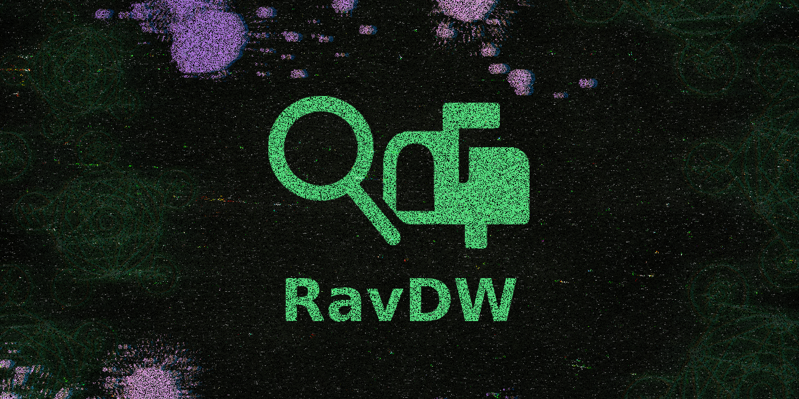

<div align="center">

<a href="https://www.npmjs.com/package/ravdw" target="_blank"></a>  
 <a href="https://www.npmjs.com/package/ravdw" target="_blank"></a>

---

# ⚙️ RAVDW

### 🔍 Consulta WHOIS simples, 📬 Sugestões inteligentes de contatos para denúncia e 📄 Sistema simples de relatório.

[](https://github.com/ravenastar-js/ravdw/stargazers)
[](https://github.com/ravenastar-js/ravdw/network/members)
[](https://www.npmjs.com/package/ravdw)
[](https://nodejs.org)
[](LICENSE)

</div>



<div align="center">
BANNER INSPIRADO EM
<br>
<a href="https://store.steampowered.com/app/1507580/Enigma_do_Medo" >
  
</a>
</div>

---

## 🎯 Visão Geral

**🔍 Consulta WHOIS simples, 📬 Sugestões inteligentes de contatos para denúncia e 📄 Sistema simples de relatório.**

## 🌟 Características Principais

- **🔍 Consulta WHOIS**: RDAP, WHOIS tradicional e Hackertarget
- **📄 Gerador de Relatórios**: Denúncias para phishing, pirataria, LGPD, malware e mais
- **🏠 Detecção Inteligente**: Identifica hospedagem gratuita e provedores
- **🌐 Internacionalização**: Português e Inglês
- **💬 Interface Amigável**: Modo interativo com menus intuitivos
- **📊 Dados Consolidados**: Informações técnicas organizadas e relevantes

📦 Instalação Rápida

<details>
<summary>📥 Como instalar o NodeJS?</summary>

- [COMO INSTALAR NODE JS NO WINDOWS?](https://youtu.be/-jft_9PlffQ)
</details>

```bash
npm i -g ravdw           # ✅ Recomendado
npm install -g ravdw     # ✅ Completo

# Após instalação, use em qualquer lugar:
ravdw help
ravdw --help
```bash

### 🔍 VERIFICAR INSTALAÇÃO

```bash
npm ls -g ravdw          # ✅ Listar pacote
npm list -g ravdw        # ✅ Completo
ravdw version            # ✅ Versão instalada
ravdw --version          # ✅ Versão instalada
```

## 🗑️ DESINSTALAR GLOBALMENTE

```bash
npm un -g ravdw          # ✅ Recomendado  
npm uninstall -g ravdw   # ✅ Completo
npm remove -g ravdw      # ✅ Alternativo
```

## 🎯 Como Usar

### 🔍 Consulta Rápida de Domínio

```bash
# Consulta básica
ravdw exemplo.com

# Consulta específica
ravdw lookup exemplo.com

# Com timeout personalizado
ravdw lookup exemplo.com --timeout=15000
```

### 📄 Gerar Relatório de Denúncia

```bash
# Relatório interativo
ravdw report exemplo.com

# Relatório com opções específicas
ravdw report exemplo.com --type=phishing --evidence=https://exemplo.com/fake-login

# Múltiplas violações
ravdw report exemplo.com --type=phishing,piracy,malware --evidence=url1,url2,url3
```

### 💬 Modo Interativo (Recomendado)

```bash
ravdw
```

### 🆘 Ajuda e Informações

```bash
# Ajuda completa
ravdw help
ravdw --help

# Versão
ravdw version
ravdw --version
```

## 📋 Tipos de Violação Suportados

| Violação | Emoji | Descrição |
|----------|-------|-----------|
| `phishing` | 🕵️ | Imitação de sites legítimos |
| `piracy` | 🏴‍☠️ | Distribuição não autorizada |
| `lgpd` | 📊 | Violação de proteção de dados |
| `childporn` | 🚫 | Conteúdo de exploração infantil |
| `hate` | 💢 | Discurso de ódio |
| `scam` | 🎭 | Golpes financeiros |
| `copyright` | 📝 | Violação de direitos autorais |
| `malware` | 🦠 | Distribuição de malware |
| `spam` | 📨 | Spam massivo |
| `other` | ❓ | Outras violações |

## 🏠 Provedores Detectados Automaticamente

- **☁️ Cloudflare Pages** (`pages.dev`)
- **🐙 GitHub Pages** (`github.io`) 
- **▲ Vercel** (`vercel.app`)
- **🎯 Netlify** (`netlify.app`)
- **🔥 Firebase** (`web.app`)
- **🔮 Glitch** (`glitch.me`)
- **⚙️ Heroku** (`herokuapp.com`)
- **📝 WordPress** (`wordpress.com`)
- **✍️ Blogger** (`blogspot.com`)
- **🌐 Weebly** (`weebly.com`)
- **🆓 000webhost** (`000webhost.com`)

## 📊 Exemplo de Saída

### 🔍 Consulta WHOIS

```text
+----------------------------------------------------+
|                                                    |
|   📋 Informações do Domínio                       |
|   Domínio: exemplo.com                              |
|   Registrado em: 15/09/1997 às 01:00:00 (-03:00)   |
|   Expira em: 14/09/2028 às 01:00:00 (-03:00)       |
|   Atualizado em: 09/09/2019 às 12:39:04 (-03:00)   |
|                                                    |
+----------------------------------------------------+

+---------------------------------------------------------+
|                                                         |
|   🏢 Informações do Registrador                         |
|   Registrador: Exemplo Inc.                             |
|   Email de Abuso: abuse@exemplo.com                     |
|   Formulário: https://www.exemplo.com/contact-us/       |
|                                                         |
+---------------------------------------------------------+
```

### 📄 Relatório Gerado

```text
🧾 ABUSE REPORT - exemplo.com

O domínio "exemplo.com", registrado por "MarkMonitor Inc.", está sendo utilizado para:
• Phishing - imitação de sites legítimos para captura de credenciais

📚 POSSÍVEIS LEIS APLICÁVEIS:
• Art. 154-A do CP — Invasão de Dispositivo Informático
• Art. 171, §2º-A do CP — Fraude Eletrônica

🎯 PRÓXIMOS PASSOS RECOMENDADOS:
  🌐 Arquive as evidências gratuitamente na Wayback Machine...
  📸 Registre as evidências em plataformas confiáveis...
```

## 🏗️ Estrutura do Projeto

```bash
📁 ravdw/
├── 📁 bin/
│   └── 🔧 ravdw.js
├── 📁 lib/
│   ├── 🌐 index.js
│   ├── 📄 lang.json
│   └── 📁 core/ ⚙️
│       ├── 🈲 i18n.js
│       ├── 🗺️ SiteMap.js
│       ├── 🛠️ utils.js
│       └── 🔍 WhoisEngine.js
├── 📁 commands/ 💬
│   ├── 🔎 lookup.js
│   ├── 📊 report.js
│   └── 💬 interactive.js
├── 📦 package.json
├── 📖 README.md
└── ⚙️ .gitignore
```


## 📄 Licença

Este projeto está sob licença MIT. Veja o arquivo [LICENSE](LICENSE) para detalhes.

---

<div align="center">

## Feito com 💚 por [RavenaStar](https://linktr.ee/ravenastar)

[⬆ Voltar ao topo](#-ravdw)

</div>
